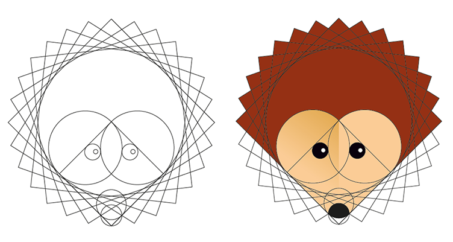
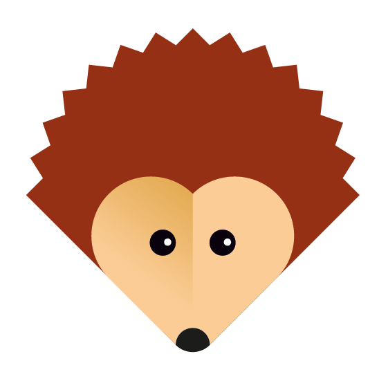
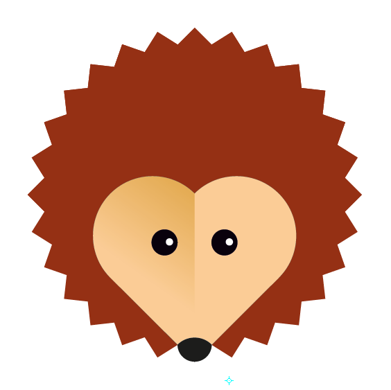
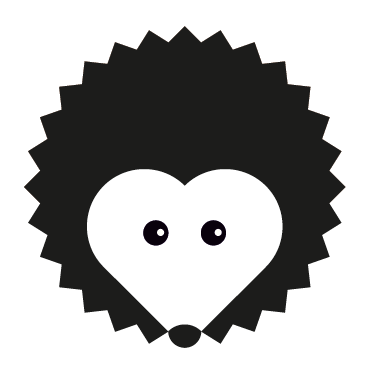
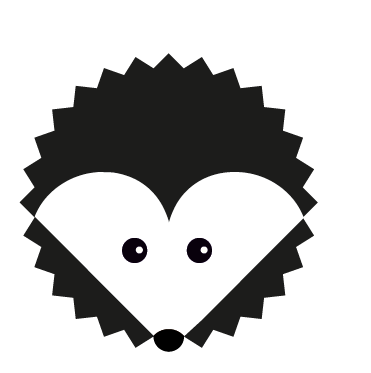

# HedgeDoc logo proposal

Proposition by eric_G

## The initial idea

The initial idea was to mix an open book shape and a heart to make a hedgehog

* **Some after thoughts**
	* The result looks a bit flat
	* Nose poping out: too cartoon
	* The shape is not a perfect circle
	* The spiny coat angles are too sharp
	* The black version does not work (we do not visually connect the white face)

## Improvements

* Rationalize shape using squares and circles
* Should fit a circle
* Easy to redraw from memory
* Should also work in black only

 

* Despite the spiny coat we have a round shape
* By closing the shape we have a logo that works in black and white
 

* And finally giving more shape to the heart...

## Possible variation

